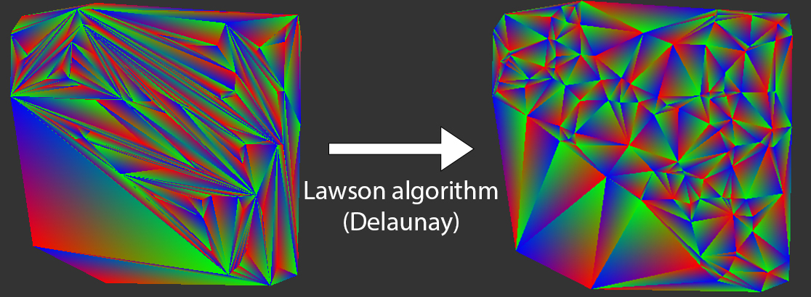

Computational geometry project that manipulates a data structure representing meshes and that allows efficient implementations of computational geometry algorithms. 

Implemented features:
- Insertion of a point outside or inside the convex hull of a triangulation + automatic meshing of the point into the existing triangulation
- Lawson algorithme to improve the quality of an existing triangulation by making a Delaunay triangulation
- Rupert algorithm (triangulation of a planar straight-line graph)

